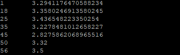
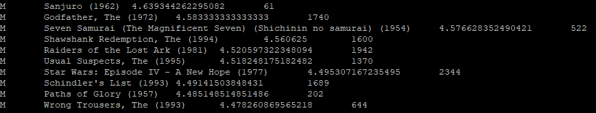
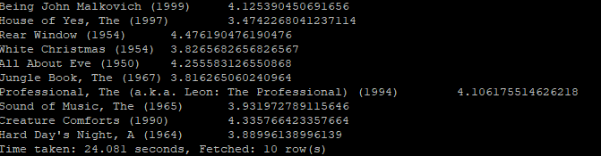

# 题目一（简单）

展示电影 ID 为 2116 这部电影各年龄段的平均影评分。

## SQL:


```SQL
Select b.age , avg(a.rate) as avgrate from t_rating_naxu a
inner join t_user_naxu b on a.userid=b.userid
inner join t_movie_naxu c on a.movieid=c.movieid
where c.movieid = 2116
group by b.age
order by b.age;
```


## 运行结果



# 题目二（中等）

找出男性评分最高且评分次数超过 50 次的 10 部电影，展示电影名，平均影评分和评分次数

## SQL:

```sql
select u.sex, m.moviename, avg(r.rate ) as avgrate, count(r.rate) as total
from t_rating_naxu r 
inner join t_user_naxu u on a.userid=b.userid
inner join t_movie_naxu m on a.movieid=c.movieid
where u.sex = 'M' 
group by m.moviename, u.sex
having total>=50
order by avgrate desc
limit 10;
```

## 运行结果：





# 题目三（选做）

找出影评次数最多的女士所给出最高分的 10 部电影的平均影评分，展示电影名和平均影评分（可使用多行 SQL）。

SQL:

```sql
Select c.moviename , avg(a.rate) as avgrate
from t_rating_naxu a 
inner join t_movie_naxu c on a.movieid=c.movieid 
where a.movieid in 
(
	select temp_a.movieid from 
		(select c.movieid as movieid , a.rate, b.userid
		from t_rating_naxu a inner join t_user_naxu b on a.userid=b.userid inner join t_movie_naxu c on a.movieid=c.movieid 
		where b.userid in 
		(select temp.userid from 
			(select bb.userid as userid ,count(aa.rate) as total 
			from t_rating_naxu aa inner join t_user_naxu bb on aa.userid=bb.userid  
			where bb.sex='F' group by bb.userid order by total desc limit 1) temp) 
		order by a.rate desc limit 10) temp_a
)
group by c.moviename
order by avgrate desc;
```

运行结果：

